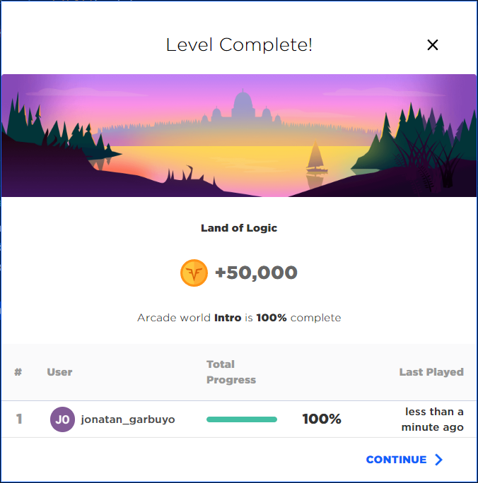
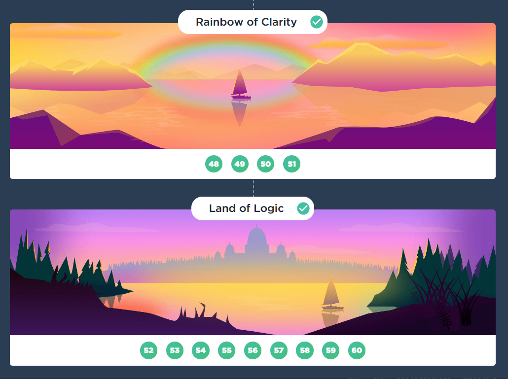

# Arcade intro with JavaScript

Practice your coding skills while unlocking the arcade map

## Table of contents

- [Overview](#overview)
  - [The challenge](#the-challenge)
  - [Screenshot](#screenshot)
  - [Links](#links)
- [My process](#my-process)
  - [Built with](#built-with)
- [Author](#author)

## Overview

### The challenge

This are my solutions to the [arcade map](https://app.codesignal.com/arcade/intro).

### Screenshots

## My process

### Built with

- pure Javascript

## Author

- Github - [Jonatan Garbuyo](https://github.com/JonatanGarbuyo)
- CodeSignal - [@JonatanGarbuyo](https://app.codesignal.com/profile/jonatan_garbuyo)
